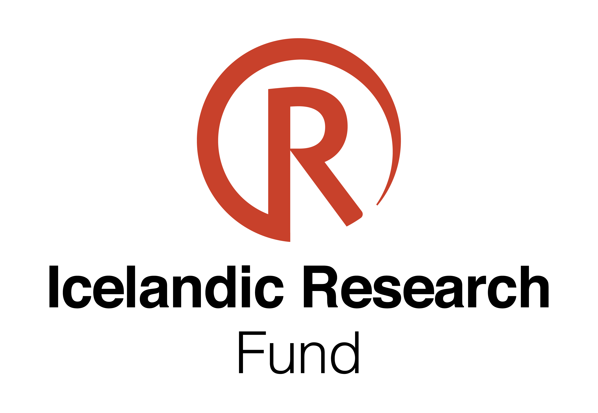
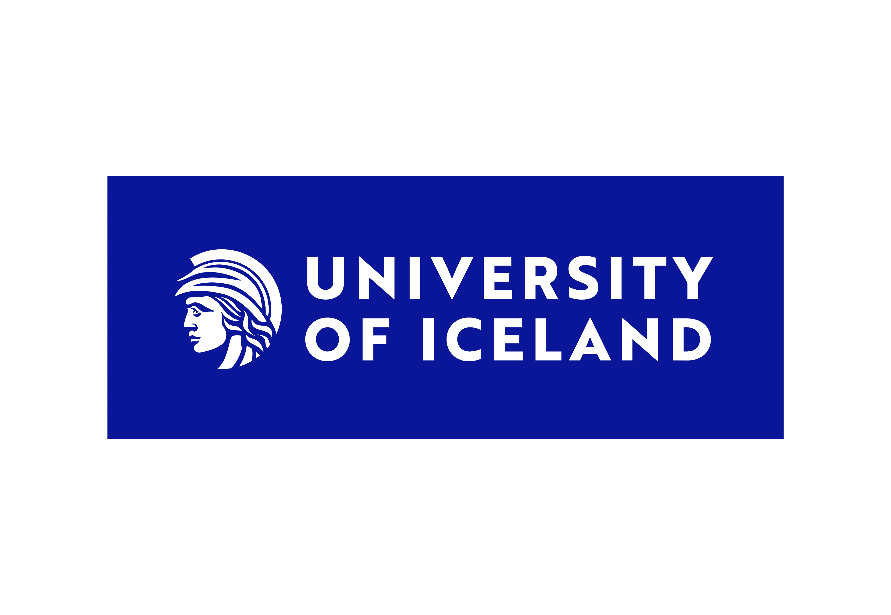

---
title:
---

<!-- <h1 style="text-align: center;"> Funding </h1> -->

<head>
    
</head>

<a href="https://en.rannis.is/news/allocation-from-the-icelandic-research-fund-for-the-financial-year-2024"> Computer Simulations of Liquid/Solid Interfaces with Applications to Electrochemical Systems</a>   
2024 - 2027  
<b>Project Grant, Icelandic Research Fund</b>   
Elvar Orn Jonsson
   

<a href="https://english.hi.is/sites/default/files/brynjadis/2023-tafla-a-vef-uppfaert.pdf"> 
Computer simulations of the interface between aqueous solution and solid surfaces</a>    
2023 - 2026    
<b>Doctoral student Grant, Eimskip Doctoral Fellowship</b>   
Anoop Ajaya Kumar Nair       
 

<body>

 <b>Funding sources:</b> 

<table>
  <tr>
    <td> 
    </td>
    <td>
    
    </td>
  </tr>

</table>
</body>